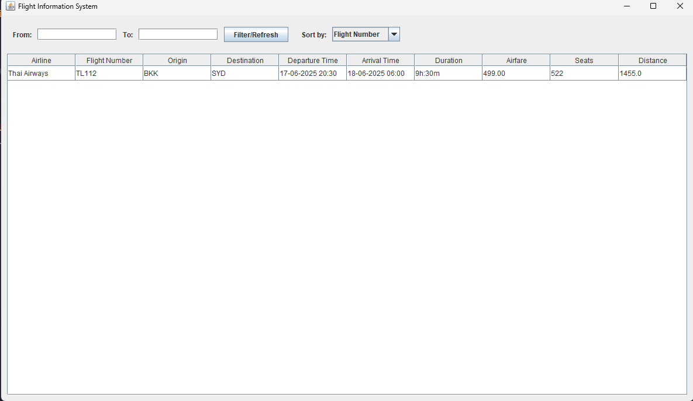

# Flight Information System

## 1. Project Description
 This project is a Java-based application for managing airline flight information. The system allows users to input details for multiple flights via a console interface. The entered data is validated, stored, and can be displayed in a sortable, filterable Graphical User Interface(GUI) built with Java Swing.
 
The core purpose of this project is to demonstrate fundamental OOP (object-oriented programming) principles, including class design, encapsulation, inheritance, and the application of design pattern Model-View-Controller (MVC).

## 2. Key Features
 
- Console Data Entry: Using console for inputting detailed flight information
- Validation: Create utils class for validation
- Sorting:
    
  - The console application provides a menu to sort flights by various options
  - The GUI allows dynamic sorting and filtering of flight data

- In-Memory Data storage: Using `FlightController` to manage a list of flight objects during runtime.
- GUI: built with Java Swing to display flight data in a structured table
- MVC Architecture: The project is structured using the Model-View-Controller pattern to separate data logic, user interface and control flow

## 3. Technologies and Tools Used

- Language: `Java`
- GUI: `Java Swing`
- IDE: `IntelliJ IDEA`

## 4. Installation and Setup

### Prerequisites
- Install JDK latest version

- Install IntelliJ IDEA

## 5. Usage instructions

You can run the application from `flightapp` directory

- Execute the main application using `SHIFT + F10`

- The program will first launch the console interface. Follow the on-screen prompts to enter flight details

- After all data has been entered via the console, the GUI window will automatically appear, display the data you just entered.

- You can use the GUI to sort and filter the flight information.

## 6. UML Diagram

